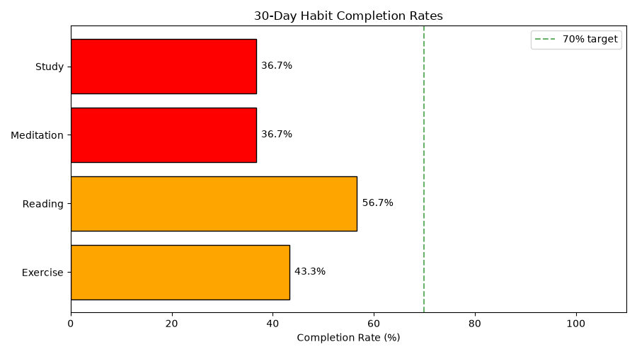
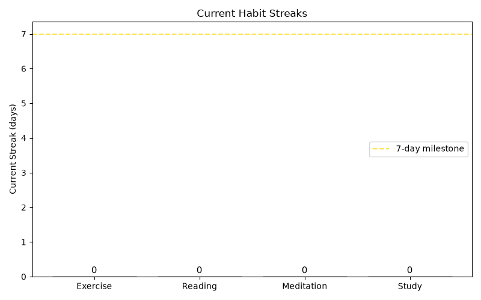
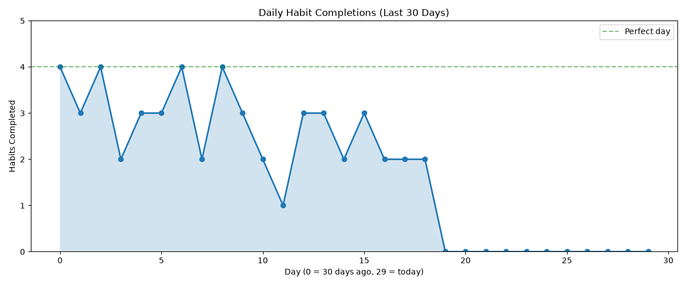
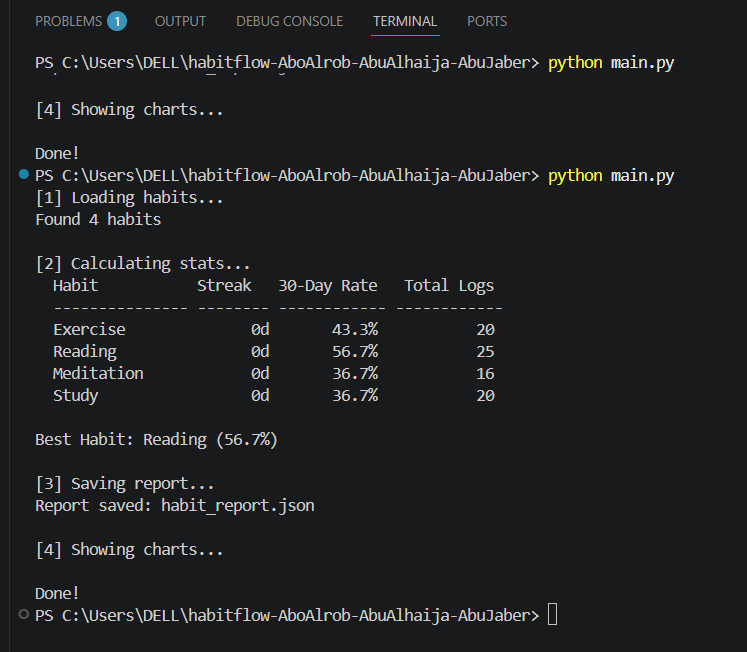

# HabitFlow — Daily Habit Streak Tracker

**Course:** Python Programming

---

## 1. Project Title & Members

**Project Title:** HabitFlow — Daily Habit Streak Tracker

**Members:**

* Qusai Hasan Shawkat Abualrob — 202210603
* Mohammad Rashed Rasheed Abu Alhaija — 202211470
* Omar Fawzy Omar AbuJaber — 202210217

**GitHub Repository:**
https://github.com/AboRob/habitflow-AboAlhaija-AbuJaber

---

## 2. Project Description

HabitFlow is a Python application designed to track daily habits and monitor user progress over time. The application stores habit information and completion logs in a JSON file. Using the datetime library, the program calculates streaks and completion rates for each habit. The application also uses Matplotlib to generate charts that help visualize habit performance and daily activity. The project demonstrates file handling, object-oriented programming, date processing, and data visualization.

---

## 3. Libraries Used

| Library    | Version  | Usage                                 |
| ---------- | -------- | ------------------------------------- |
| datetime   | Built-in | Date calculations and streak tracking |
| json       | Built-in | Loading and saving data               |
| matplotlib | 3.11.0   | Creating charts and visualizations    |

---

## 4. Module Descriptions

### habit_tracker.py

Contains the HabitTracker class. This module is responsible for loading and saving habit data, adding new habits, logging daily completions, calculating streaks, and generating habit statistics.

### stats_reporter.py

Contains the StatsReporter class. It prints habit statistics in a formatted table, finds the best habit based on completion rate, and exports statistics to a JSON report file.

### visualizer.py

Contains the Visualizer class. It generates three charts: completion rate chart, streak chart, and daily activity chart using Matplotlib.

### main.py

Acts as the entry point of the application. It loads data, calculates statistics, displays reports, saves results, and generates visualizations.

---

## 5. Test Cases

### Test Case 1: Run Full Application

**Input:** `python main.py`

**Expected Output:** Application loads data, calculates statistics, saves a report, and displays three charts.

**Actual Output:** Application completed successfully and displayed all required outputs.

---

### Test Case 2: Streak Calculation

**Input:** Habit logs containing consecutive dates.

**Expected Output:** Correct streak value.

**Actual Output:** Streak values appeared correctly in the statistics table.

---

### Test Case 3: Statistics Generation

**Input:** Habit data loaded from `habits.json`.

**Expected Output:** Statistics list containing total logs, streak, and completion rate.

**Actual Output:** Statistics were generated successfully.

---

### Test Case 4: JSON Report Export

**Input:** Statistics list and output file path.

**Expected Output:** JSON report file created successfully.

**Actual Output:** Report file was generated correctly.

---

## 6. Screenshots

### Completion Rate Chart



### Streak Chart



### Daily Activity Chart



### Terminal Output



---

## 7. Individual Contributions

| Student                             | ID        | Responsibilities                        |
| ----------------------------------- | --------- | --------------------------------------- |
| Qusai Hasan Shawkat Abualrob        | 202210603 | create_sample_data.py, habit_tracker.py |
| Omar Fawzy Omar AbuJaber            | 202210217 | stats_reporter.py, requirements.txt     |
| Mohammad Rashed Rasheed Abu Alhaija | 202211470 | visualizer.py, main.py                  |

---

## 8. Challenges & Lessons Learned

### Qusai

The most challenging part was implementing streak calculations using dates. This improved understanding of datetime operations and data structures.

### Omar

The main challenge was formatting habit statistics clearly in the terminal and exporting reports correctly.

### Mohammad

The most challenging part was creating and integrating multiple charts using Matplotlib and connecting them with project statistics.

---

## 9. How to Run

### Install Dependencies

```bash
pip install -r requirements.txt
```

### Generate Sample Data

```bash
python create_sample_data.py
```

### Run Application

```bash
python main.py
```
